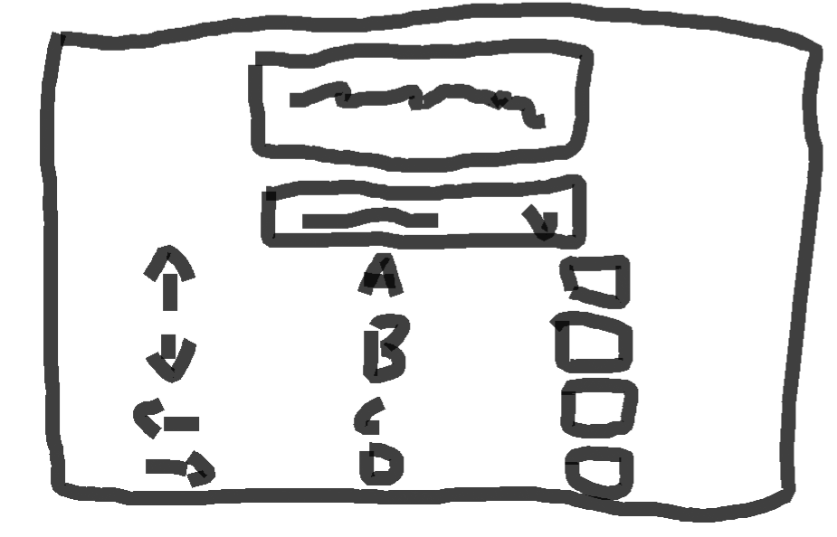

Name: Hong Yue Wang \
Student Number: 300105373 \
Submission For: SEG 4105 Deliverable 1/Lab 3 - the Pitch

# Problem
Currently, our client has to rely on a web application to use our mouse attachment. It can be quite cumbersome to have to open a browser page and type in the URL. We are looking for all OS-compatible software that replicates what is done on the current web application so the client can access its features with less steps.

# Appetite
It will not be possible rebuild the entire application as a desktop application within 6 weeks, especially since the web version is also constantly evolving during that time. Therefore, what we have at the end of 6 weeks should be a rudimentary version of the application. Therefore, we should aim for no more than a version of Porteus with the default set of profiles (Work, School and Gaming) without utilizing any sign-ins.

# Solution
We will create a desktop application using Electron, a free and open-source frameworks designed to create desktop applications using JavaScript or TypeScript. Electron is compatible with Windows, macOS and Linux, which makes it an ideal choice in terms of compatibility. This Electron application will include similar UI from the web application, but modified to fit Electron's environment. This iteration of the desktop application will center around the Profiles page with its default profiles and keybinds. The sign-in, account settings and overlays will be omitted from now since our main focus is to make the connection to the hardware via desktop application accesible to our client.

[Insert Breadboarding]
# Rabbit Holes
We will ensure that the Electron application is generated in TypeScript, the same as the web application, instead of plain JavaScript and that it uses React to avoid having to translate code form one language/framework to another. We will ensure the application does not stray away from the web app's UI and UX to make the transition seemless for the client. We will ensure that the Profiles page is accessible without authentication.
# No Gos (if applicable)
We are not adding novel pages to the Electron application as it is not necessary to answer the pitch's problems.