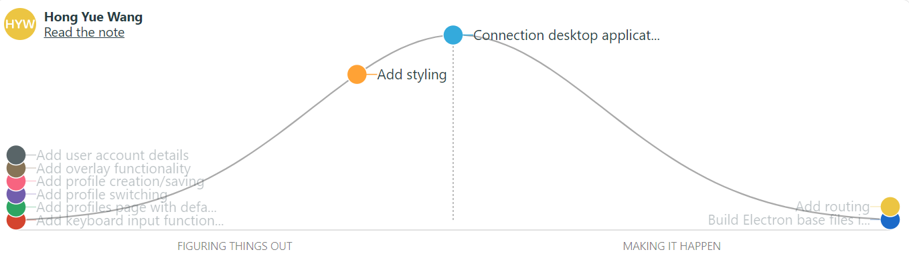

Name: Hong Yue Wang \
Student Number: 300105373 \
Submission For: SEG 4105 Lab 7 Stand-up

# Stand-up notes

Recently, I have worked on various stories. Firstly, I fixed the longstanding issue of the sidebar cutting off when the application is scrolled down. I have fixed the flow of the web application when the user is signed out, directing them to the sign in page if they try to access any restricted pages. Furthermore, I have created the base files for the Electron desktop application and is working on the routing. I will keep working on those tasks and I do not have any blockers.

# Hill chart

# Pull request summary
https://github.com/Macomatic/T40-Mouse-Accessibility-Attachment/pull/32

https://github.com/Macomatic/T40-Mouse-Accessibility-Attachment/pull/30

https://github.com/Macomatic/T40-Mouse-Accessibility-Attachment/pull/28 

Pull request in progress for Electron routing

# Meeting schedule

Thursday, November 2 2023 2:30 PM - 3:30 PM: https://github.com/Macomatic/T40-Mouse-Accessibility-Attachment/blob/main/Minutes.md#november-2-2023-230---330-pm 

Thursday, November 9 2023 5:00 PM - 6:00 PM

Thursday, November 16 2023 5:00 PM - 6:00 PM

Thursday, November 23 2023 5:00 PM - 6:00 PM

Thursday, November 30 2023 5:00 PM - 6:00 PM
